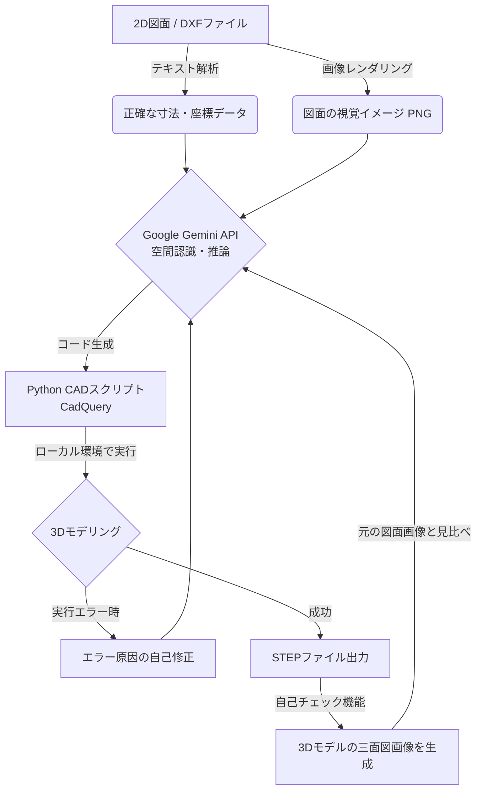

# CAD Gemini Generator

2D CAD図面（DXF）を読み込み、生成AI（Google Gemini）のマルチモーダル（画像＋テキスト）認識能力を活用して、3D CADモデル（STEPファイル）を全自動で生成するPythonプログラムです。

## ✨ 特徴

*   **テキストと画像の二刀流**: DXFから抽出した「正確な寸法・座標テキスト」と、「図面全体のレンダリング画像」の両方をAIに渡し、計算ミスを防ぎつつ立体構造を把握させます。
*   **AIによる自己視覚チェック機能**: 3Dモデル生成後、自動で三面図画像を書き出し、元の図面とAI自身に見比べさせます。穴の抜けや位置ズレがあれば自分でコードを書き直す「セルフデバッグ」を行います。
*   **バッチ処理対応**: 複数のDXFファイルを一括で連続処理することが可能です。

## ⚙️ システム構成・処理フロー



## 🚀 インストール方法

1. リポジトリをクローンまたはダウンロードします。
2. 必要なライブラリをインストールします。
   ```bash
   pip install -r requirements.txt
   ```
   ※ `cadquery` については、環境に応じて conda などでのインストールが推奨されます。
3. プロジェクトのルートディレクトリに `.env` ファイルを作成し、ご自身のGoogle Gemini APIキーを設定してください。
   ```text
   GEMINI_API_KEY=AIzaSyYourAPIKeyHere...
   ```
4. プロジェクト内に `input/` および `output/` フォルダを作成します。

## 使い方

### 複数ファイルの一括処理（推奨）
`input/` フォルダ内に複数のDXFファイルを入れ、以下のコマンドを実行します。
```bash
python batch.py
```
処理結果（STEPファイルや実行ログ）はすべて `output/` フォルダに自動保存されます。

### 単一ファイルの処理
特定のファイルだけを処理したい場合は、以下のように実行します。
```bash
python main.py input/あなたの図面.dxf
```

## 💡 特殊な図面へのヒント機能
AIがどうしても勘違いしやすい図面がある場合、DXFと同じフォルダに `[図面ファイル名]_hints.txt` を配置することで、AIに最優先のローカルルール（例：「この穴のZ座標は-25が正しい」など）を指示することができます。


## 💰 APIクレジット（利用枠）とコスト管理について

本ツールはGoogle Gemini APIを使用するため、APIキーの利用枠（クレジット）にご注意ください。

* **完全無料枠（Free Tier）で利用する場合**
  * 課金設定をしていないプロジェクトで発行したAPIキーは完全無料です。
  * **制限事項**: `Pro` モデルを使用する場合、無料枠では「1分間に2回まで」という厳しい回数制限（レートリミット）があります。1つの図面を処理するだけで制限に達するため、一括処理時はリトライ待機で時間がかかります。
* **有料枠（Pay-as-you-go）で利用する場合**
  * 制限なくスムーズに複数図面の一括処理が可能です。
  * **コスト目安**: 高精度な `Pro` モデルを使用した場合、図面1枚（画像による自己チェックループ含む）あたり概算で **数円〜十数円程度** のクレジットを消費します。
  * **エラー時の対処**: `402 RESOURCE_EXHAUSTED (Your prepayment credits are depleted)` というエラーが出た場合は、事前チャージの残高が 0 になっています。Google AI Studio でクレジットを追加するか、新しい無料枠のAPIキーを作り直して `.env` を書き換えてください。
* **節約テクニック**
  1. **モデルの変更**: `main.py` 内の `MODELS_TO_TRY` を編集し、安価で高速な `Flash` モデル（`gemini-3.8-flash`等）を最優先にすると、精度はやや落ちますがコストを10分の1以下（1図面1円未満）に抑えられます。
  2. **画像チェックの省略**: `main.py` の `VISUAL_VERIFY_ROUNDS = 2` を `0` に変更すると、完成後の「自己視覚チェック（やり直し）」を行わなくなるため、API呼び出し回数を最小限に節約できます。
