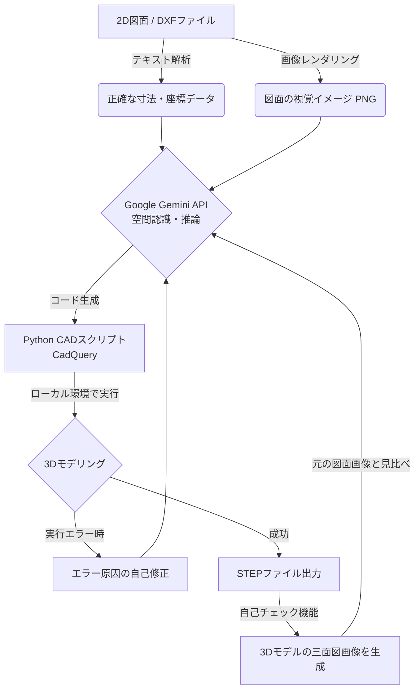

# AIを活用した2D図面からの3Dモデル自動生成システム 概要資料

本システムは、2D CADの図面ファイル（DXF）を読み込み、生成AI（Google Gemini）のマルチモーダル（画像＋テキスト）認識能力を活用して、3D CADモデル（STEPファイル）を全自動で生成するPythonプログラムです。

## 1. システムの全体像

従来、人間が図面を見て手作業で行っていた「図面の読み取り」と「3Dモデリング」の工程をAIに代替させることで、モデリング工数の大幅な削減を目指します。

## 2. 処理のステップ詳細

本システム（`main.py`）は、内部で以下の5つのステップを全自動で実行します。

### STEP 1: 図面のデータ化（テキスト抽出＆画像化）
AIに図面を正確に理解させるため、DXFファイルから2種類のアプローチで情報を抽出します。
*   **テキストデータの抽出**: 図面内に書き込まれた「寸法値」「注記」「穴の数」や、線の正確な座標を文字情報として抽出します（※Pythonライブラリの『ezdxf』を使用してDXF内部のデータを直接読み取り、図枠などの不要なレイヤーを除外した上で、線や円の座標、寸法線の数値などをAIが読みやすいテキスト形式のリストとして抽出しています）。
*   **画像データの作成**: 図面全体を人間が見るのと同じ「画像（PNG）」として出力します（※『ezdxf』と描画ライブラリ『matplotlib』を連携させ、DXFデータを白背景・黒線の見やすい画像として書き出します。文字化けを防ぐための日本語フォントの置換処理も自動で行っています）。

### STEP 2: AIによるコード生成 (Gemini API)
抽出したテキストデータと画像データを同時にGoogle Gemini APIに送信します。
事前に定義された「モデリングの厳密なルール（曲げRの付け方や長穴の扱いなど）」に従い、AIがオープンソースの3D CADライブラリである **「CadQuery」用のPythonコード** を記述します。

### STEP 3: ローカル環境での3D構築
AIから返ってきたPythonコードを、即座にローカル環境で実行します。
*   もしコードに文法エラーやCADエンジンの処理エラーがあった場合は、エラーログを再度AIに送り、「ここが間違っているので直して」と自動で **自己修正（セルフデバッグ）** を行わせます。

### STEP 4: AIの「自己視覚チェック」（※設定で省略可能）
モデルが完成すると、システムはその3Dモデルから「正面図・平面図・側面図」の三面図画像を自動生成します。
この画像を再びAIに送り、**「一番最初に送った元の2D図面と見比べて、穴が抜けていたり、形が違っている部分はないか？」** を目視確認させます。間違いがあれば再度コードを書き直して作り直します。

### STEP 5: 最終出力
チェックを通過した（または規定回数に達した）最終的な3Dモデルを、汎用フォーマットである **STEPファイル** として出力し、処理を完了します。

---

## 3. 採用技術・ライブラリ
*   **言語**: Python 3.x
*   **AIモデル**: Google Gemini 1.5/3.1 Pro (マルチモーダルAI)
*   **2D図面解析**: `ezdxf` (DXFデータのパース)
*   **3Dモデリングエンジン**: `CadQuery` / `OCP` (OpenCASCADEテクノロジーをベースにしたスクリプトベースのCADライブラリ)
*   **バッチ処理**: 複数ファイルを連続で自動処理するためのラッパー（`batch.py`）を実装済
